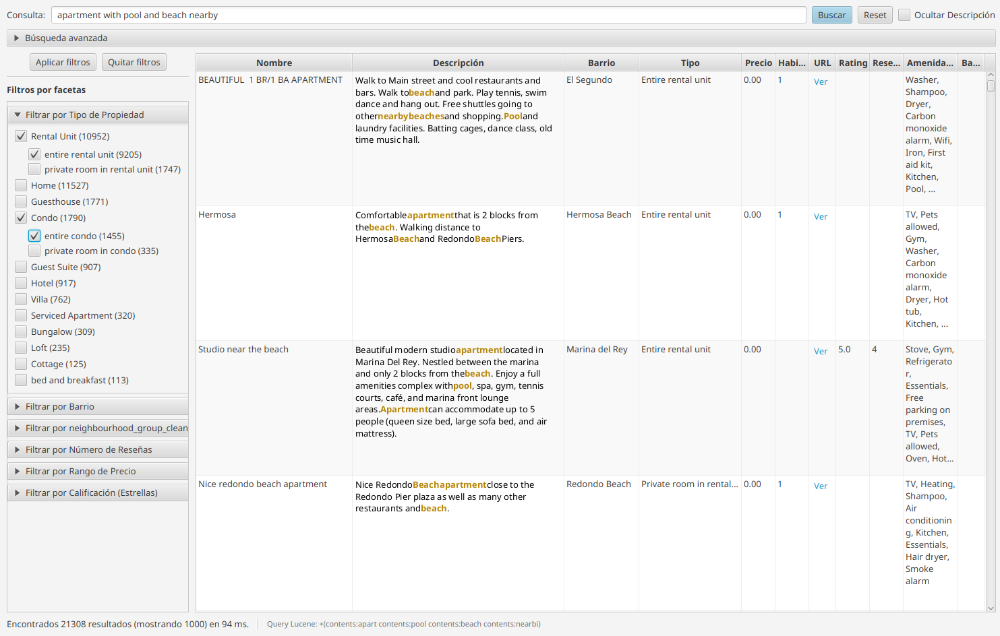

# Airbnb Lucene Analyzer

**Airbnb Lucene Analyzer** is a comprehensive Information Retrieval project built with **Java 21** and **Apache Lucene 10**. It demonstrates how to build a production-grade search ecosystem from scratch, featuring robust CSV indexing, relational data modeling, interactive search UI, and machine learning classification.

The project processes the **Los Angeles Airbnb Data (June 2025)** dataset obtained from [Kaggle](https://www.kaggle.com/datasets/wafaaalayoubi/los-angeles-airbnb-data). This dataset contains public information available in the Inside Airbnb project for the city of Los Angeles, California. The data was collected on June 17, 2025, and provides a detailed view of Airbnb listings at that time. The dataset comes in a `listings.csv` file with a total of 79 columns and about 45,000 resources.

---

## 🚀 Key Features

*   **Robust Indexing Engine**: Parses complex CSV data, handling multi-line fields, missing values, and data anomalies.
*   **Relational Index Design**: Implements a "Join" strategy by maintaining separate indices for `Properties` and `Hosts`, linked by ID.
*   **Interactive Search App**: A JavaFX graphical interface providing Real-time search, Faceted filtering (Neighborhoods, Types), and Geospatial queries.
*   **Machine Learning Classifier**: Evaluates algorithms (Naive Bayes, KNN, Fuzzy KNN) to categorize listings based on unstructured text (e.g., predicting neighborhood from description).
*   **Advanced Text Analysis**: Utilizes `EnglishAnalyzer` for stemming/stopwords on descriptions and `StandardAnalyzer` for exact metadata.

---

## 🛠 Prerequisites

*   **Java**: JDK 21 or higher.
*   **Maven**: 3.6+ installed.
*   **Data**: `listings.csv` in the project root.

---

## 📦 Build & Run

### 1. Compilation
We use Maven to manage dependencies and package the application.

```bash
# Clean and compile
mvn clean compile

# Create standalone JAR (includes all dependencies)
mvn clean package
```
*Artifact created at*: `target/airbnb-indexer.jar`

### 2. Indexing the Data
Before searching, you must build the indices. This process reads `listings.csv` and generates the Lucene indices.

```bash
java -jar target/airbnb-indexer.jar --input ./listings.csv --index-root ./index_root --mode build
```
*   `--mode build`: Creates new indices. Use `rebuild` to wipe and recreate, or `update` to add new records.
*   **Output**: Generates `index_root/index_properties` and `index_root/index_hosts`.

### 3. Launching the Search UI
The JavaFX application allows you to explore the indexed data visually.

```bash
mvn javafx:run -Djavafx.args="--index-root ./index_root"
```


### 4. Running Classifiers
Analyze the performance of Lucene's classification module.

```bash
java -cp target/airbnb-indexer.jar AirbnbClasificador --index-root ./index_root
```

---

## 📂 Index Structure & Schema

The project splits data into two optimized indices. Here are the key fields and their configurations:

### 🏠 Index: Properties (`index_properties`)
| Field | Lucene Type | Analyzer | Note |
|-------|-------------|----------|------|
| `id` | IntPoint | - | Primary Key |
| `name` | TextField | Standard | Full-text searchable |
| `description` | TextField | **English** | Stemmed, stopwords removed |
| `neighbourhood_cleansed` | StringField + Facet | Keyword | Normalized lowercase |
| `property_type` | StringField + Facet | Keyword | Normalized lowercase |
| `amenity` | TextField (Multivalued) | Standard | Individual amenities indexed |
| `price` | DoublePoint | - | Numeric ranges |
| `location` | LatLonPoint | - | Geo-spatial queries |
| `host_id` | StringField | Keyword | Foreign Key to Host Index |

### 👤 Index: Hosts (`index_hosts`)
| Field | Lucene Type | Analyzer | Note |
|-------|-------------|----------|------|
| `host_id` | StringField | Keyword | Primary Key |
| `host_name` | TextField | Standard | |
| `host_about` | TextField | **English** | |
| `host_response_time` | StringField + Facet | Keyword | |
| `host_is_superhost` | IntPoint (0/1) | - | Boolean flag |

---

## 🔍 Search Guide & Syntax

You can use **Luke** (Lucene Index Toolbox) or the provided Search App to query the data.

### Common Query Syntax (Lucene Standard)
*   **Keyword Search**: `beach` (Finds "beach" in default field)
*   **Specific Field**: `name:ocean` OR `description:pool`
*   **Phrase Match**: `description:"walking distance"`
*   **Wildcards**: `name:beac*` (Matches beach, beacon, etc.)
*   **Boolean Logic**: `pool AND wifi NOT party`
*   **Numeric Ranges**: `bedrooms:[2 TO 4]` (Inclusive)

### ⚠️ Important Notes for specific fields
1.  **StringFields (Neighborhood, Type)**: These are exact match only.
    *   *Correct*: `neighbourhood_cleansed:hollywood`
    *   *Incorrect*: `neighbourhood_cleansed:"Hollywood"`
2.  **Price & Ratings**: Indexed as `DoublePoint`.
    *   In **Java Code**: Fully supported for ranges (`price:[100 TO 200]`).
    *   In **Luke**: These fields **cannot** be searched in the "Search" tab due to a GUI limitation. Use the "Documents" tab to inspect values.

---

## 🏗 Architecture & Design Decisions

### **1. Analyzers & Normalization**
We deliberately chose `EnglishAnalyzer` for `description` and `host_about` to handle English morphology (e.g., matching "running" with "run"). For metadata like `amenities` or `name`, `StandardAnalyzer` is used to preserve more specific tokens. String identifiers (Neighborhoods) are normalized to lowercase to ensure case-insensitive exact matching.

### **2. Relational Indexing**
Instead of denormalizing host data into every property listing (which would duplicate "Host Name" thousands of times), we maintained a normalized schema.
*   **Pros**: Smaller index size, faster updates for host details.
*   **Cons**: Requires application-level "joins" (two queries) to display host info alongside property results.

### **3. Robust CSV Parsing**
The indexer implements a custom multi-line CSV handling logic because standard parsers often fail with user-generated content containing newlines within quotes. We track `max-errors` to allow the process to finish even if a few rows are corrupt, ensuring resilience.

---

## 👥 Authors
Project developed for the **Information Retrieval (RI)** course, 2025 with [Emilio Guillen Alvarez](https://github.com/Emilio-GA)

## 📚 Additional Resources & Text Analysis

It is recommended to consult the Javadoc for the specific version of Lucene being used (currently **10.3.0** / **10.3.1**).

*   **Main Documentation**: [Lucene 10.3.0 Documentation](https://lucene.apache.org/core/10_3_0/index.html)
*   **Text Analysis**: The [Analysis Package](https://lucene.apache.org/core/10_3_0/core/org/apache/lucene/analysis/package-summary.html) is particularly important, as it handles converting input text into tokens. Lucene performs a sequence of operations on the text, such as splitting by whitespace, removing stop words, and stemming.
*   **Demo**: [Lucene Demo](https://lucene.apache.org/core/10_3_0/demo/index.html)

